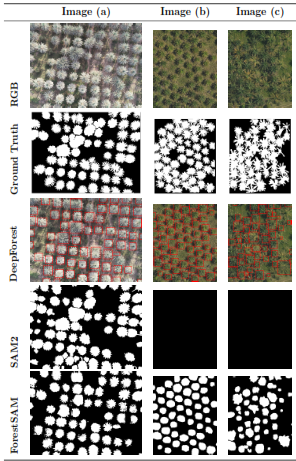
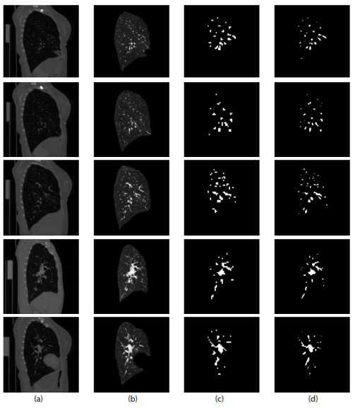

# Hi 👋 I'm Juan Pablo Suárez

### Computer Vision Engineer | Remote Sensing AI | Geospatial Intelligence

Building AI solutions using **Satellite Imagery**, **Drone Vision**, **LiDAR**, and **Deep Learning** for Earth Observation.

 

---

# 👨🏻‍💻 About Me

I'm a Computer Vision Engineer from Colombia passionate about developing Artificial Intelligence solutions for Earth Observation, Remote Sensing, Environmental Monitoring, Precision Agriculture and Medical Imaging.

My work focuses on combining Computer Vision, Deep Learning and Geospatial Intelligence to transform aerial, satellite and LiDAR data into meaningful insights.

---

# 🔬 Research Interests

---

# 🌱 Currently Exploring

- 🌍 Foundation Models for Earth Observation
- 🛰️ Large-scale Satellite Image Analysis
- 🚁 Drone-based Computer Vision
- 🌳 Forest and Agricultural Monitoring
- 📡 LiDAR Point Cloud Processing
- 🤖 Vision-Language Models
- 🧠 Multimodal AI

---

# 💻 Tech Stack

## Programming Languages

---

## Artificial Intelligence

---

## Geospatial Technologies

---

## Development Tools

---

# 📚 Publications

<table>
<tr>

<td width="38%" align="center">

</td>

<td width="62%" valign="top">

### 🌴 ForestSAM

**A Novel Integration of DeepForest and SAM2 for Oil Palm Crown Segmentation in Aerial Imagery**

A hybrid Computer Vision framework that integrates **DeepForest** and **Segment Anything Model 2 (SAM2)** for accurate oil palm crown segmentation from aerial imagery, improving precision agriculture and remote sensing applications.

 

 

📄 **Paper:** https://link.springer.com/chapter/10.1007/978-3-032-23161-1_3

💻 **Code:** *Coming Soon*

</td>

</tr>
</table>

---

<table>
<tr>

<td width="38%" align="center">

</td>

<td width="62%" valign="top">

### 🫀 Pulmonary Arterial Segmentation

**Deep Learning-Based Pulmonary Arterial Segmentation in Computed Tomography Images**

Deep learning approach for automatic pulmonary artery segmentation in CT images, supporting accurate and efficient medical image analysis.

 

 

📄 **Paper:** https://ieeexplore.ieee.org/document/10637810

</td>

</tr>
</table>

# 🔥 Contribution Streak

---

# 📈 Contribution Graph

---

# 📖 Currently Learning

- Vision Transformers
- Vision-Language Models
- Foundation Models
- Multimodal AI
- Large Vision Models
- 3D Computer Vision

---

# 🌎 Beyond Research

- 🎩 Card Magic
- 🪙 Numismatics
- 🌲 Nature & Outdoor Activities
- 📷 Drone Mapping

---

### "Using Artificial Intelligence to better understand our planet."

